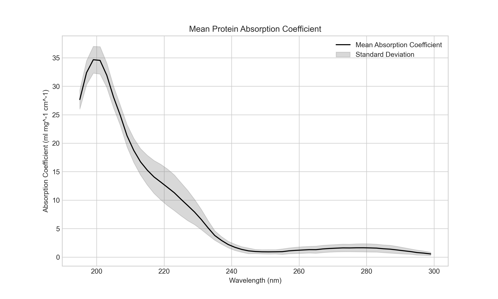

# Protein Absorption Coefficient Analysis

This repository contains data and Python scripts used for the calculation and plotting of mean and standard deviation (stdv) absorption coefficients of six proteins.

## Background

The absorption of UV light by proteins, while a common method for protein quantification, is also a vital parameter in assessing the safety of far-UVC light. Increased protein absorption, particularly in the far-UVC range, is considered a primary reason why these wavelengths are potentially safer for human exposure.

The peak in protein absorption in the far-UVC range is largely attributed to the peptide bond, which is a common structural feature in all proteins. Thus, it's expected that the absorption profiles of different proteins would be similar in this range.

To standardize the comparison of absorptions across different molecules and experimental setups, we use the Beer-Lambert law. The Beer-Lambert law describes how the absorption of light by a substance is related to the properties of the substance and the light. Specifically, it states that the absorbance (A) is equal to the product of a substance's molar absorptivity (ε), its concentration (c), and the path length of the light (l): A = εcl.

In this context, we use the law to calculate the absorption coefficient (ε) from the measured absorbance, given the concentration of the protein and the path length of the light. This allows us to compare the inherent absorption properties of different proteins independently of their concentration or the specific experimental setup.

## Repository Structure

* `raw-data/`: Contains the raw CSV files extracted from the Kreusch et al. paper, one for each protein.
* `processed-data/`: Contains the preprocessed CSV files with data sorted by wavelength and interpolated at 2 nm intervals.
* `preprocess.py`: Python script for sorting and interpolating the raw data.
* `analysis.py`: Python script for calculating the mean and stdv absorption coefficients and for plotting the data.

## Methodology

The methodology used in this analysis is as follows:

1. Data for six proteins was extracted from the Kreusch et al. (2003) paper using webplotdigitizer. The green rectangle seen in the plot was assumed to represent human IgG, as this was shown as a green cross in the legend.

2. The raw data was preprocessed using `preprocess.py`. The data was sorted in ascending order based on wavelength, and the absorbance was calculated at rounded 1 nm intervals between 195 and 299 nm using linear interpolation.

3. The `analysis.py` script was then used to calculate the mean and stdv of the absorbance across the six proteins at each wavelength.

4. Finally, the mean and stdv absorption coefficients were calculated using the Beer-Lambert law, with a path length of 0.341 cm and a concentration of 0.05 mg ml-1.

## Results

Figure 1: Mean absorption coefficient and standard deviation for six proteins: bovine a-chymotrypsinogen, bovine immunoglobulin-c, horse hemoglobin, lysozyme, human immunoglobulin-c, and human serum albumin. Data is derived from Kreusch et al. 2003.

## References

Kreusch, S., Schwedler, S., Tautkus, B., Cumme, G. A. & Horn, A. UV measurements in microplates suitable for high-throughput protein determination. Analytical Biochemistry **313**, 208–215 (2003).

